# Providing a Callback/Webhook URL for Receiving Activity Feed Notifications

[Most activities or events][1] in your Route4Me account (whether you use the [web application][50] or its [mobile apps][51]) such as your driver entering or leaving a geofenced area, marking an address as visited, or just adding a note to one of your destinations, are logged into your Activity Feed. You can subscribe and receive data about these activities in a real-time manner by providing a callback or webhook URL for your Activity Feed. The URL can either be from your web application’s URL or a third-party service such as Zapier or Integromat, that can then interpret and act upon the data it receives from Route4Me. Then, depending on your needs or workflow, what you do with the data Route4Me gives you is up to you. You can send an SMS message to your users or customers, log the data to a backup database, or update your external CRM software. Your only limit is your imagination.

To provide a callback URL for your Activity Feed, log in to your account in Route4Me and click the “My Account” menu (the bottommost menu/icon) in the sidebar, and then click “Account Settings”.

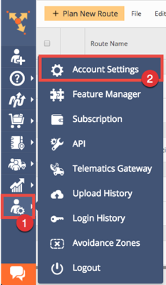

Scroll below until you see the “Activity Feed Settings” section. Provide your callback URL and make sure you select “POST” as the callback method. Depending on your needs, you might also opt to use “PUT” as the method. Click “Save” to save your settings.

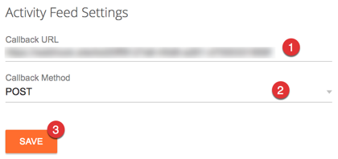

Your callback URL is now ready to receive data from Route4Me.

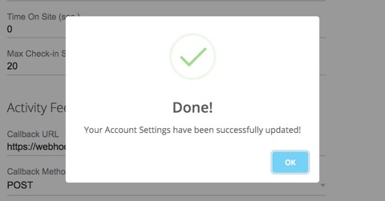

## Using a Webhook Testing Service

For development and testing purposes, you can use a webhook testing website or service that can generate for you a random webhook URL. You can then use the URL as the callback URL of your Activity Feed ([see section above][10]) and use its website to inspect and study the payload Route4Me sends to the webhook URL.

Select from any of these websites or services:

* [Webhook.site][52]
* [WaitHook][59]
* [RequestBin][60]

As an example, the following images show the generated URL from <a href="https://webhook.site">Webhook.site</a> and using it as the callback URL of a Route4Me account's Activity Feed.

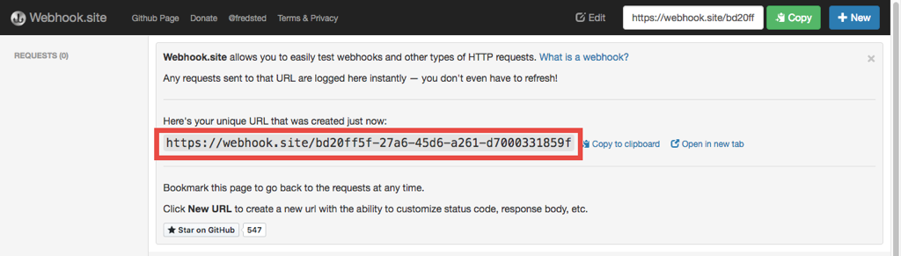

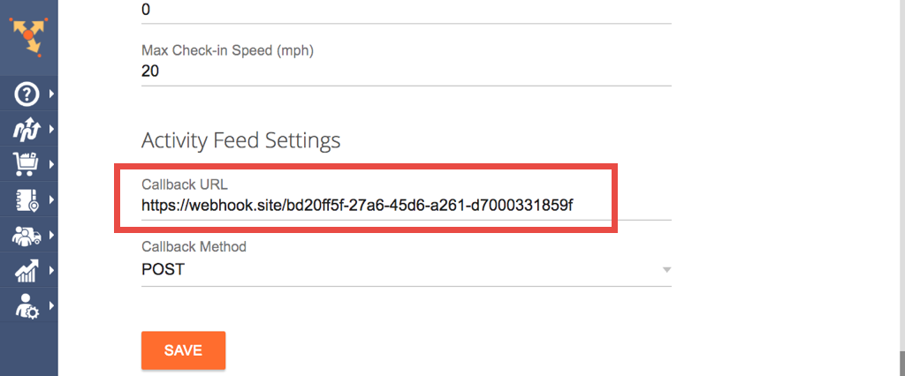

The next thing you need to do is to test the webhook URL. Kindly follow along as the next section demonstrates how to do this.

## Testing the Callback URL and Inspecting the Data Sent by Route4Me

Once you've configured your Activity Feed's callback URL with the generated URL of your chosen webhook testing service/website, it's now time to test the generated URL if Route4Me can detect or recognize it (in most cases, it does).

Every time Route4Me detects activity or an event in your account, it sends a payload to your Activity Feed's callback URL. Some examples of these events are the "Mark Destination as Departed/Visited", "Note Inserted", and "Route Optimized". For more information, here's [a list of the supported activities or events][1] that are logged into the Activity Feed.

We'll use the [Route4Me web application][50] to perform an activity and the [Webhook.site][52] webhook testing website to monitor and inspect the payload. For our examples, we demonstrate performing a "Note Inserted" and "Route Optimized" activity.

To follow the examples, first, log in to your Route4Me account using the web application and ensure that you have some route records that you can play with.

Also, ensure that your Activity Feed's callback URL is also the same URL that Webhook.site is listening (waiting for requests) to.

<h3 id="example1">Performing and Monitoring a Note Inserted Activity</h3>

To perform a "Note Inserted" activity, select any route in your [Routes List][53] and click on its name to open it.

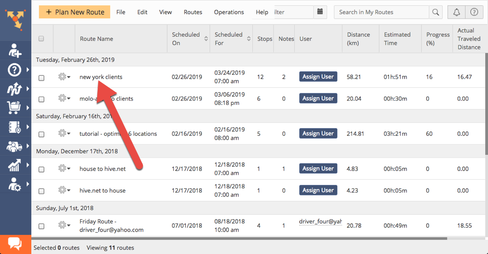

Once opened, select and click on the address or stop you would want to add a note. Next, click the "Add a Note" button.

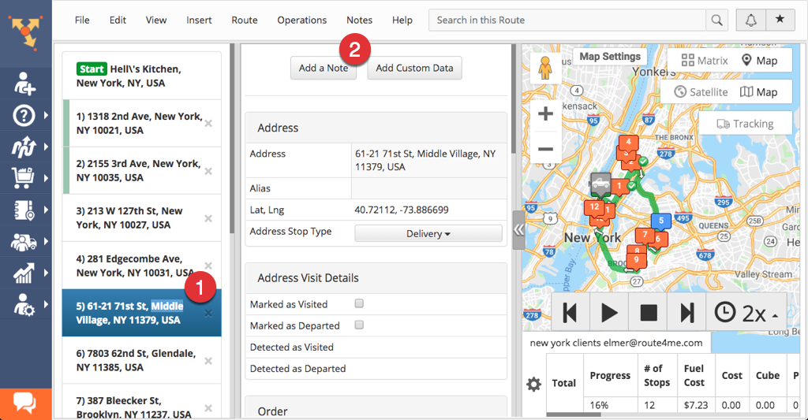

Provide the details of the note with values matching the ones in the screenshot below and then click "Add Note" when finished.

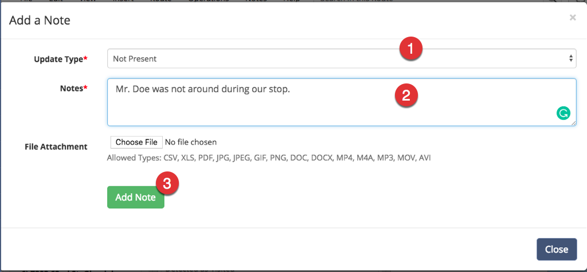

Once your new note is added, you can then check your Activity Feed and see that the note inserting activity is logged there.

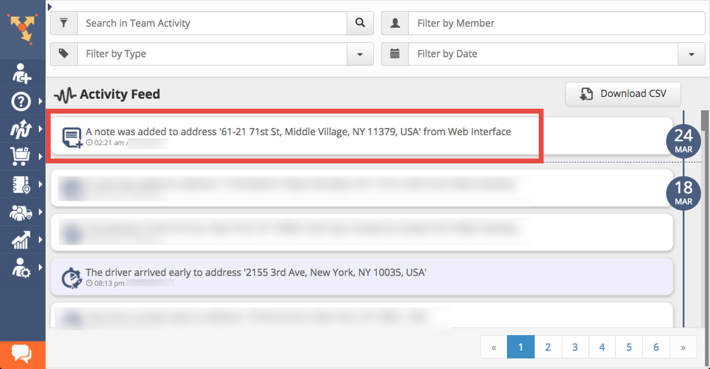

Now, return back to Webhook.site and see if your webhook URL can receive a payload from Route4Me. The payload, which is a JSON object, can be seen at the bottom part of the page. If you can see it, then Route4Me can see or recognize your webhook URL. If not, then review again [if your Activity Feed's callback URL matches the one that Webhook.site is currently listening][11].

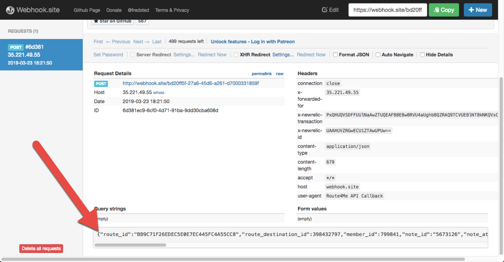

Next, copy and paste the JSON object to your text editor. If you want, you can also use [a JSON Formatter][54] to make it more readable.

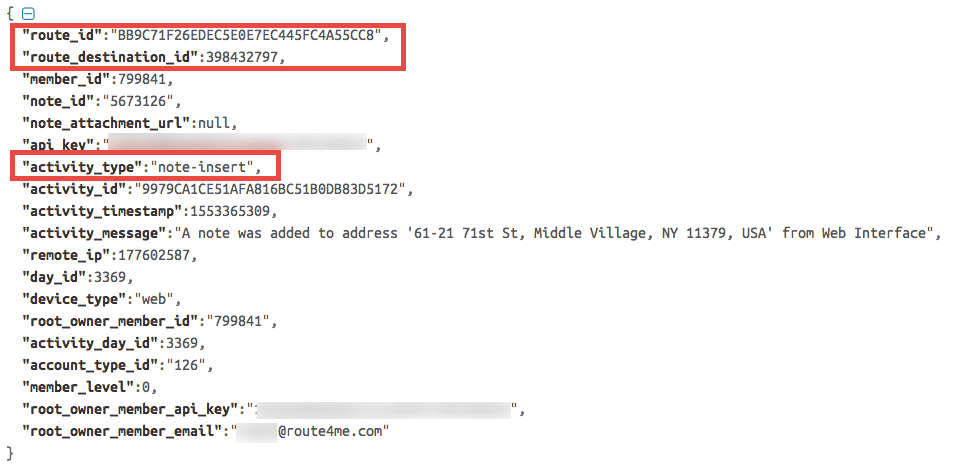

Familiarize yourself with the structure of the JSON object as this is what your callback URL will be receiving coming from Route4Me. Take note though that the JSON object's properties vary depending on the activity or event that occurred. Specific activities have more or fewer properties than others. For your reference, we have written a separate [article that describes the callback payload][2] (the JSON object) in detail.

In our example, the properties we're interested in are `activity_type`, `route_id`, and `route_destination_id`. Checking for the value of the `activity_type` property is a given, as it's the label or name of the activity or event that just occurred. If you are monitoring many activities, use the `activity_type` property to filter them from the rest of the others.

Meanwhile, you can also use the `route_id` and `route_destination_id` properties if you need to know the actual note that was inserted. Our [Platform API][55] has a [Note resource][56] where you can query for notes attached to a specific address or stop within a route.

To retrieve the notes attached to an address, you'll need to use the `route_id` and `route_destination_id` properties as query string parameters when making a request to [one of the endpoints of the Note resource][57].

Now armed with information from the payload, what you do next or how you'll proceed is ultimately up to you.

### Performing and Monitoring a Route Optimized Activity

To perform a "Route Optimized" activity, select any route in your Routes List and click on the gear icon beside it.

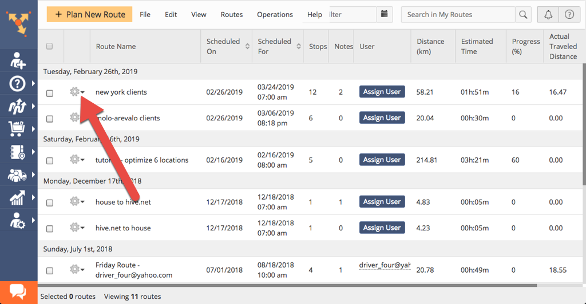

Then, click "Re-optimize Route" to start the optimization process.

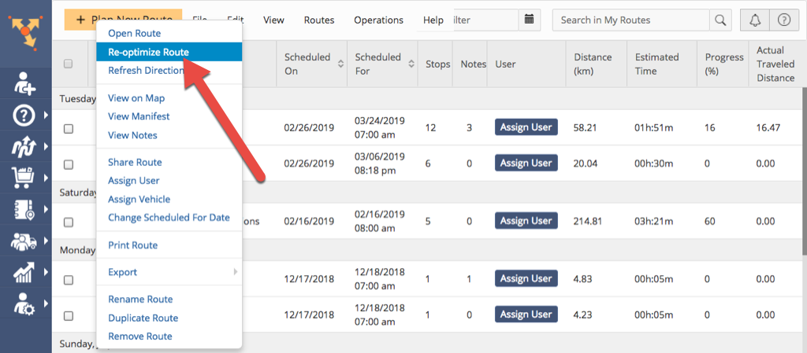

Once done, check your Activity Feed as the activity is logged there.

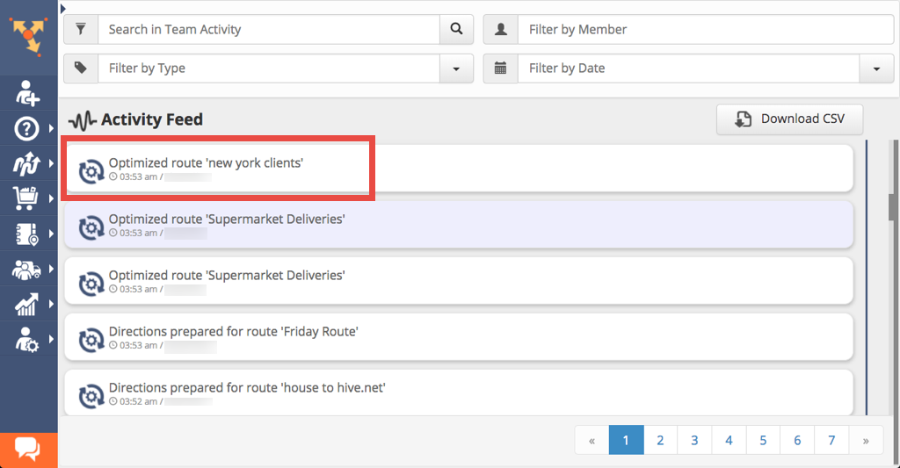

Then, return to Webhook.site and check the payload sent to your webhook URL. You would see something similar to this screenshot below:

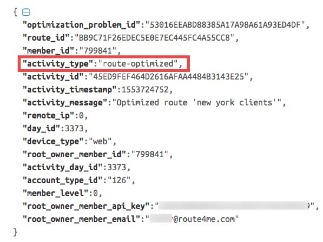

[Identical to the previous example][12], the `activity_type` property is your definitive guide to determining what type of activity or event the payload is associated with. The `route_id` property is also useful if you are interested in knowing more about the optimized route. 

If you need more information regarding the optimized route, you can make a request to one of the endpoints of our [Platform API's][55] [Route resource][58]. 

________

Although as an example we used a sample webhook URL provided by a webhook URL testing service or website, **the best way to take advantage of these notifications is to provide a custom URL or endpoint from your own web application or web service**. This way, your application can process the incoming data (through code) and then programmatically make decisions based on it.

This concludes our tutorial for providing a callback or webhook URL for receiving real-time notifications from your Activity Feed.

[1]:  supported-activities.md
[2]:  callback-payload.md

[10]:   #callback-url-setting
[11]:   #matching-urls
[12]:   #example1

[50]:   https://www.route4me.com
[51]:   https://route4me.com/mobile
[52]:   https://webhook.site

[53]:   https://support.route4me.com/using-the-routes-list-to-view-planned-routes/

[54]:   https://jsonformatter.curiousconcept.com/

[55]:   https://route4me.io/docs/#platform-apis
[56]:   https://route4me.io/docs/#notes
[57]:   https://route4me.io/docs/#get-notes
[58]:   https://route4me.io/docs/#get-a-route

[59]:   https://waithook.com/
[60]:   https://requestbin.com
